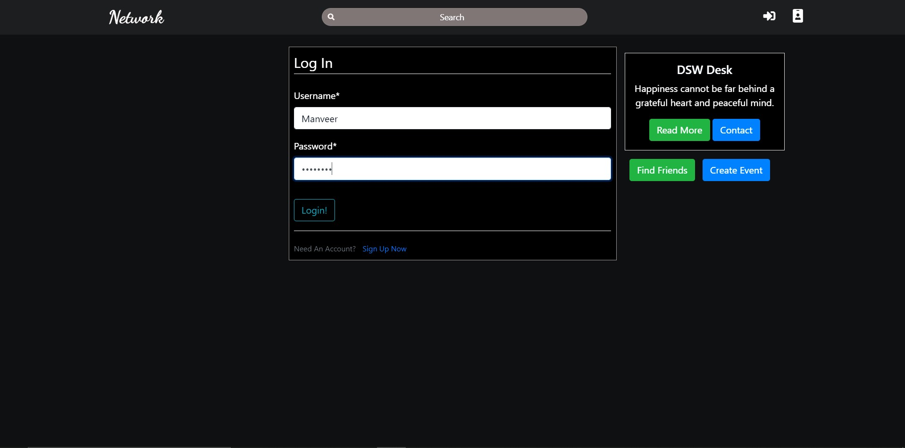
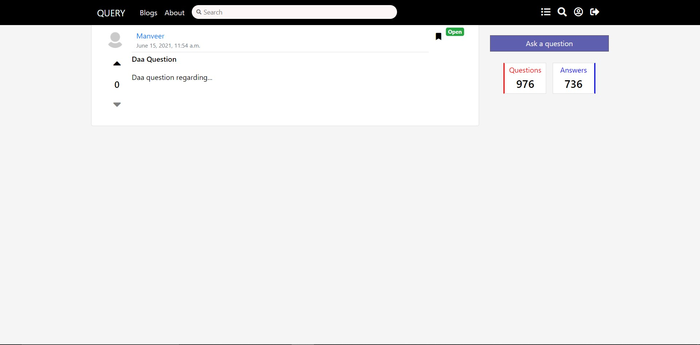

# College Social Network

## Introduction

Hello everyone, my name is Manveer Singh Kahlon. This is the repository of my 6th sem
minor project which I worked on with my teammate Rohit. The web app's backend is written completely in django with
a little bit of Ajax for asynchronous works. I had no knowledge of web development prior to working on this project and thus it worked as a learing experience for me. I learned about web development from scratch using django through a short tutorial and the rest was just learning on the way to developing this website. <br>
The motivation for this project was to establish a platform where students could house their question and queries and get answers for the same. There doesnt seem to be a repository for storing past questions that students may have had, hence this will allow for a forum where students can learn from each other.<br> This constitues the Query part of the website which I developed as well as a face login authentication system as part of a two-factor login. My teammate developed the social media aspects of the webiste as part of his motivation for the project. 

## Features

<ul>
  <li>New Users can register and then subsequently login to their account.</li>
  <br><br>
  
  

<br><br>


<br><br>

  <li>Logged in users can create posts which will be visible to all the users who follow them.</li>
  <br><br>


<br><br>

  <li>Users can also create requests to follow other users.</li>

<br><br>


<br><br>

  <li>Follow requests will be visible on the homepage which can be accepted.</li>
  <br><br>


<br><br>

  <li>Authenticated Users can also like and comment on the posts of other users who have followed them.</li>

<br><br>


<br><br>

  <li>A suggestion link at the navbar provides a list of users to follow.</li>

<br><br>


<br><br>

  <li>A Question and Answer section where authenticated users can ask and answer questions.</li>

<br><br>



<br><br>
  
<li>A Sample Question.</li>
  
<br><br>  
 
  

<br><br>    
</ul>

## Under Development

<ul>
  <li>Direct messaging between the users.</li>
  <li>Tagging Friends in posts, questions, etc.</li>
  <li>A better UI aimed at simplifying the application</li>
  <li>Making the face recognition more robust</li>
</ul>

## Installation

<p>Follow these steps to run the web app in your local machine</p>

<ol>
  <li>Make a virtual environment</li>
  <li>Clone the git repo using the command
  
  ``` bash
  git clone https://github.com/RohitRoy741/minor.git
  ```
  </li>
  <li> Move inside the minor directory (the one which contains requirements.txt) </li>
  <li> Install the requirements using pip
  
  ``` bash
  pip install -r requirements.txt
  ```
  </li>
  <li> Run the local server 
  
  ``` bash
  python manage.py runserver
  ```
  </li>
</ol>

## Contribution

<p> Any contribution is welcome, the web app is yet a work in progress. You can do a pull requests however it will better to
open and issue for discussing major changes </p>
